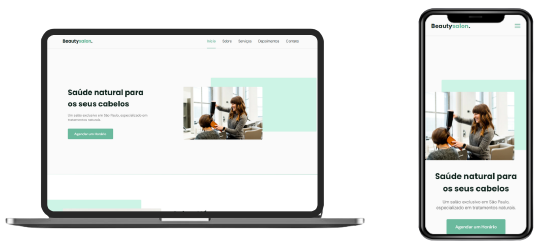
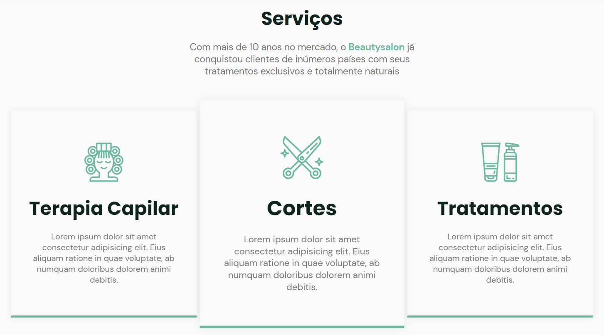

<h1 align="center"> ✂️ BeautySalon. </h1>

<h2 align="center"> 📝 Descrição </h2>

<p align="center">Projeto de um suposto salão de cabeleireiro feito na trilha origin durante a NLW 6.</p>
<hr>

<h3 align="center"> 🏁 Tópicos </h3>
<p align="center">
 <a href="#design">Design</a> •
 <a href="#como-baixar">Como Baixar</a> • 
 <a href="#tecnologias">Tecnologias</a> • 
 <a href="#my-changes">Minhas mudanças</a> • 
 <a href="#creator">Criador</a> •
 <a href="#contribute">Como Contribuir?</a>
</p>

<h4 align="center"> 
	Status: ✅ CONCLUÍDO ✅
</h4>
<hr>
<h2 align="center" id="design">
  🎨 Design
</h2>
<h1 align="center">
  </h1>
  <h3 align="center"><a href="https://www.figma.com/file/YJ21RnZoelU6tthwExzMVP/Origin-Six/duplicate">Link no Figma</a><br></h3><hr>
  <h2 align="center">A Paleta de cores</h2>
  <h3 align="">A Paleta de cores do projeto foi feita de uma forma que fique fácil de trocar as cores.</h3><br>
  <h3 align="center">Indo na linha <b>26/27</b> no arquivo style.css você encontrará isso:</h3>
  
  ```css
  26 /* Cores Recomendadas: 159, 36, 270, 345 */
  27 --hue: 159;
  ```
  <h3>Você pode trocar a variável <b>"--hue"</b> Para qualquer valor entre 0 e 359, mas deixei as cores recomendadas na linha 26 </h3><hr>

<h3 id="como-baixar" align="center"> Como baixar o projeto? </h3>

```bash
# Clone o Repositório
$ git clone https://github.com/IgorVini25/Beautysalon-NLW6.git
```

Ou baixe o arquivo .zip clicando [AQUI](https://github.com/IgorVini25/Beautysalon-NLW6/archive/refs/heads/main.zip)

<hr>

<h3 id="tecnologias" align="center"> ⚒️ Tecnologias e API's </h3>

As seguintes tecnologias foram usadas na construção do projeto:

- HTML 5
- CSS 3
- Javascript

As Seguintes API's foram utilizados no projeto:

- [ScrollReveal](https://scrollrevealjs.org/)
- [Swiper](https://swiperjs.com/)

---

<h3 id="my-changes" align="center"><b>Minhas Mudanças</b></h3>
<p>Na minha visão o design já estava muito bom, fiz apenas uma mudança.</p>

<h3>Desde os tablets até os dispositivos maiores os Cards ficam um ao lado do outro, e quando está no estado Hover ele fica maior. Tive que mudar a forma em que os cards ficavam um ao lado do outro, jpa que com display Grid nçao é possível usar a propriedade "Transform" do CSS.</h3>

---

<h2 align="center" id="creator"> Criador </h2>
<h3 align="center">
<a href="https://github.com/maykbrito">
 
 <br />
 <sub><b>Mayk Brito</b></sub></a> <a href="https://github.com/maykbrito">🚀</a>
</h3>

---

<h2 align="center">🤝 Como Contribuir?</h2>
<br>
<p align="center">
⭐️Deixe sua estrela<br>
🐛Encontre e reporte bugs<br>
📥Envie PRs para ajudar a resolver bugs<br>
↪️Compartilhe o Repositório
</p>
